# System Execution Strategy & Work Breakdown

## Objective
Establish IP connectivity on Ethernet Port 1 and fix the USB Host enumeration handshake for the CY7C67200 co-processor, followed by robust HID integration and conformance testing.

## Division of Labor

### Local Agent (Gemini CLI)
*   **Fast Iteration:** Compile firmware, generate SoC, synthesize bitstream, and program the FPGA.
*   **Firmware Tweaks:** MDIO register writes (Action 1.1) and USB HID Boot Protocol implementation (Action 2.2).
*   **Tool Execution:** Run Python diagnostic scripts (`monitor_uart.py`, `etherbone_probe.py`, `test_usb_kvm.py`).
*   **Project Management:** Maintain backlog, update documentation, and create GitHub issues.

### Remote/Asynchronous Agent (Google Jules)
*   **Deep Analysis:** Instrument the gateware with LiteScope and analyze AXI-stream traces for the MAC (Action 1.2) and Wishbone traces for the HPI Bridge (Action 2.1).
*   **Root Cause Resolution:** Diagnose complex RTL timing violations or deeply nested firmware state machine failures based on the captured traces.

## Task Sequence & Parallelization

The following graph illustrates the execution flow. 
- Phase 1 (Ethernet) and Phase 2 (USB) are initially tackled together (Parallel Instrumentation) to minimize lengthy Quartus compilations.
- Trace analysis and firmware integration are performed sequentially based on the trace results.
- Phase 3 (Conformance/Best Practices) tasks are decoupled and tracked separately.

```mermaid
graph TD
    subgraph Phase 3: Conformance & Best Practices
        A[Action 3.1: USB-IF Conformance Testing]:::github
        B[Action 3.2: Ethernet RFC 2544 Benchmarking]:::backlog
    end
    
    subgraph Phase 1 & 2: Gateware Instrumentation & Build
        C[Action 1.1: MDIO Delay Tuning]:::local
        D[Action 1.2: LiteScope MAC Instrumentation]:::jules
        E[Action 2.1: LiteScope HPI Bridge Trace]:::jules
        
        C --> F[Full Build Cycle: FW -> SoC -> SOF]:::local
        D --> F
        E --> F
    end
    
    subgraph Execution & Analysis
        F --> G[Analyze ETH Trace & Fix IP Connectivity]:::jules
        F --> H[Analyze USB Trace & Fix Host Handshake]:::jules
        
        G -.-> B
        H --> I[Action 2.2: Implement USB HID Boot Protocol]:::local
        I -.-> A
    end

    classDef github fill:#f9f,stroke:#333,stroke-width:2px;
    classDef backlog fill:#bbf,stroke:#333,stroke-width:2px;
    classDef local fill:#bfb,stroke:#333,stroke-width:2px;
    classDef jules fill:#fbb,stroke:#333,stroke-width:2px;
```

## Detailed Action Plan

### Phase 1: Establish Ethernet Connectivity (Priority)
1.  **Action 1.1: Configure Internal RGMII Delays via MDIO (Local Agent - Immediate)**
    *   *Implementation:* Modify `firmware/src/main.c` to enable internal TX/RX delays on the Marvell PHY via MDIO Register 20.
    *   *Trade-off:* Replaces fragile FPGA-side PLL clock shifting with robust, PHY-calibrated delays. Highly recommended.
2.  **Action 1.2: Instrument LiteEth MAC with LiteScope (Google Jules - Blocked by 1.1)**
    *   *Implementation:* If Action 1.1 fails, modify `de2_115_vga_target.py` to inject a `LiteScopeAnalyzer` into the SoC to capture the AXI-stream `sink` (RX) and `source` (TX) of the Ethernet MAC.
    *   *Trade-off:* Consumes Block RAM for trace storage, but provides exact visibility into whether ARP packets are arriving at the MAC layer.

### Phase 2: USB Host Mode & HID Integration
1.  **Action 2.1: SignalTap / LiteScope Trace of the HPI Bridge (Google Jules - Immediate)**
    *   *Implementation:* The co-processor detects the KVM (H1STAT: 0x003C) but fails to send the "Connected" (0x1000) message. Instrument the Wishbone-to-HPI bridge (`CY7C67200_IF.v`) to trace IRQ and Mailbox pins during enumeration.
    *   *Trade-off:* Required to see why the CY7C67200 IRQ isn't triggering the firmware state machine.
2.  **Action 2.2: Implement Standard USB HID Boot Protocol (Local Agent - Blocked by 2.1)**
    *   *Implementation:* Once the handshake is fixed, force the KVM into "USB HID Boot Protocol" (fixed 8-byte/3-byte format) instead of parsing complex HID Report Descriptors.
    *   *Trade-off:* Fast, highly reliable, and universally supported by KVMs. Avoids writing a complex descriptor parser in C.

### Phase 3: Conformance & Compliance
1.  **Action 3.1: USB-IF Host & HID Compliance Testing (Deferred - GitHub Issue #1 Created)**
    *   *Implementation:* Use the USB Command Verifier (USB20CV) to check if the host implementation correctly handles enumeration, suspend/resume, and malformed descriptors according to the USB 2.0 Spec (Chapter 9).
2.  **Action 3.2: Ethernet RFC 2544 Benchmarking (Deferred - Local Backlog)**
    *   *Implementation:* Standardized testing to evaluate throughput, latency, and frame loss of the LiteEth implementation.
    *   *Trade-off:* Proves the Gigabit link is capable of Gigabit speeds without dropping frames. Optimization is secondary to achieving basic connectivity.
