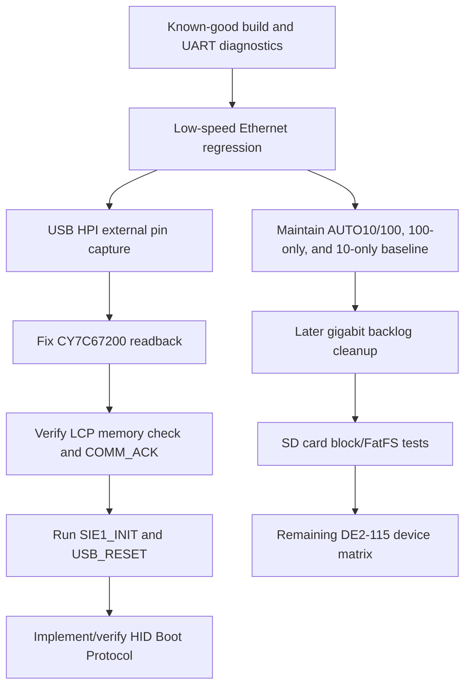

# System Execution Strategy & Work Breakdown

## Objective

Finish board bring-up by keeping the now-working Ethernet forced-10/100 path stable, resolving CY7C67200 HPI readback so USB host firmware can proceed to LCP/SIE/HID enumeration, and then expanding device coverage with repeatable tests.

## Current Baseline

- Firmware, SoC generation, Quartus compile, and programming all complete successfully.
- Ethernet Port 1 is active by default.
- PHY17 responds over MDIO and the forced-MII low-speed path is validated.
- AUTO10/100, 100-only, and 10-only firmware variants each pass 50/50 host ping to `192.168.178.50`.
- Etherbone CSR access passes through `litex_server` on host TCP port `1235`; the current regression probes green LED CSR access and stresses red LED CSR write/read.
- USB HPI writes are proven at the FPGA bus/pin-sample level.
- USB HPI reads from CY7C67200 still return `0x0000`, including CY control/status probes and memory readback.

## Task Sequence



## Phase 1: USB HPI Readback Blocker

### Action 1.1: Capture HPI Read/Write Cycles

Use SignalTap or an external logic analyzer to capture one firmware memory write and one firmware memory read.

Signals:

- `OTG_DATA[15:0]`
- `OTG_ADDR[1:0]`
- `OTG_CS_N`
- `OTG_RD_N`
- `OTG_WR_N`
- `OTG_RST_N`
- `OTG_INT`

Expected write evidence already seen in firmware debug:

```text
HPI DBG WR ... sample=00001234 cy=00001234
```

Expected read failure currently seen:

```text
HPI DBG RD ... sample=00000000 cy=00000000
```

Goal: determine whether the CY7C67200 is not driving the bus, the FPGA is sampling at the wrong time, or reset/boot/strap state is preventing HPI read response.

### Action 1.2: Compare Against Terasic Demo

Run a known-good Terasic USB demo bitstream on the same board if available.

Goal: distinguish project RTL/firmware issues from board/CY7C67200 hardware state.

### Action 1.3: Resume Protocol Work Only After Readback

Do not keep modifying LCP/SIE/HID protocol flow until a basic HPI memory write/read or CY control-register read returns nonzero/expected data.

## Phase 2: Ethernet Port 1 Baseline

### Action 2.1: Preserve Known-Good Low-Speed Ethernet

Current pass criteria:

- `python scripts\ethernet_low_speed_test.py --ping-count 50 --csr-loops 512 --bind-port 1235` passes.
- The default AUTO10/100 firmware passes.
- `FIRMWARE_CFLAGS=-DDE2_ETH_SPEED_MODE=100` passes.
- `FIRMWARE_CFLAGS=-DDE2_ETH_SPEED_MODE=10` passes.
- `litex_server --udp --udp-ip 192.168.178.50 --bind-port 1235` probes the board.
- `RemoteClient(... port=1235)` can read identifier memory, probe green LED CSR access, and stress red LED CSR write/read.

Do not destabilize this path while working on USB. Treat it as the board's current remote-control baseline.

Latest validation:

- AUTO10/100: programmed checksum `0x033D7486`, 50/50 ping, 512 CSR loops passed.
- 100-only: programmed checksum `0x033D701B`, 50/50 ping, 512 CSR loops passed.
- 10-only: programmed checksum `0x033D6EDD`, 50/50 ping, 512 CSR loops passed; extended 200/200 ping plus 4096 red-LED CSR loops passed.

The board is currently programmed with the 10-only validation image. Rebuild/program the default AUTO10/100 image when a general-purpose network baseline is preferred.

The 10-only validation image is tracked in git at
`validation_images/de2_115_vga_platform_eth10_validated_20260426.sof`.

The complete preserved Ethernet baseline is documented in
`ETHERNET_BASELINE.md`; check it before changing Ethernet, USB, clocks, or PHY
setup.

The complete board-wide device matrix and remaining peripheral strategy are in
`DEVICE_STATUS_AND_BRINGUP.md`.

### Action 2.2: Later Gigabit Cleanup

Use source/probe or SignalTap to restore gigabit RGMII only after USB is unblocked or deliberately paused. This is a backlog item, not part of the current robustness scope.

Signals:

- RGMII `rx_ctl`, `rx_data[3:0]`, and `eth_rx_clk`.
- LiteEth RX valid/ready/last around the preamble checker.
- LiteEth MAC RX error and preamble error signals/counters.
- Etherbone UDP RX valid/ready.
- Optional RGMII `tx_ctl`, `tx_data[3:0]`, and GTX clock if TX becomes suspect.

Current defaults:

- Board/Etherbone IP: `192.168.178.50`
- Local LiteEth MAC IP: `192.168.178.51`
- Remote host IP default in target: `192.168.178.27`

Latest tested variant:

- Port 1 GTX clock pin is `C23`.
- The active design forces MII/10-100 operation and forwards the PHY-derived TX clock.
- AUTO10/100, 100-only, and 10-only ping and Etherbone CSR stress tests pass.

## Phase 3: USB HID Integration

Blocked until CY7C67200 HPI readback, LCP ACK, and SIE initialization are working.

Once unblocked:

- Load LCP and verify memory readback.
- Confirm `COMM_ACK` for `COMM_JUMP2CODE`.
- Confirm `SIE1_INIT` and `USB_RESET` ACKs.
- Wait for `0x1000` connect message.
- Prefer HID Boot Protocol first before implementing report-descriptor parsing.

## Phase 4: Whole-Board Device Strategy

After Ethernet and USB have stable pass/fail tests, target SD card next. It is already instantiated, useful for loading assets/logs, and testable with deterministic block-read/block-write/FatFS checks. Track full-board progress in `DEVICE_STATUS_AND_BRINGUP.md`.

Standard per-device bring-up rule:

- Audit pins and electrical standards against Terasic QSF/manual references.
- Add the smallest RTL/CSR surface needed for direct control.
- Add firmware self-test with a concise UART result.
- Add a host-driven test where possible through Etherbone.
- Add source/probe or SignalTap hooks for the first failure boundary.
- Document pass criteria in `FINDINGS.md` and update `HANDOFF.md`.

Suggested order:

- Baseline: clocks, reset, SDRAM, UART, LEDs, 7-segment, LCD, VGA.
- Current blockers: USB HPI/CY7C67200 and Ethernet regression tests.
- Next substantive device: SD card block access, then FatFS.
- Human I/O: PS/2, switches/buttons, IR receiver.
- Media: audio codec and I2C control path.
- External memory/expansion: SRAM, flash, RS232, GPIO/HSMC/SMA.
- Optional expansion: second Ethernet port and gigabit mode cleanup.

## Verified Commands

```powershell
docker compose exec -T litex_builder /bin/bash -c '/workspace/scripts/build_firmware.sh'
docker compose exec -T litex_builder /bin/bash -c '/workspace/scripts/build_soc.sh 1'
```

```powershell
docker compose exec -T litex_builder /bin/bash -lc 'FIRMWARE_CFLAGS=-DDE2_ETH_SPEED_MODE=100 /workspace/scripts/build_firmware.sh'
docker compose exec -T litex_builder /bin/bash -lc 'FIRMWARE_CFLAGS=-DDE2_ETH_SPEED_MODE=10 /workspace/scripts/build_firmware.sh'
```

```powershell
C:\intelFPGA_lite\22.1std\quartus\bin64\quartus_sh.exe --flow compile de2_115_vga_platform
```

Program:

```powershell
powershell -ExecutionPolicy Bypass -File .\scripts\load_bitstream.ps1
```

Low-speed Ethernet regression:

```powershell
python scripts\ethernet_low_speed_test.py --ping-count 50 --csr-loops 512 --bind-port 1235
```

Host-side SignalTap collection:

```powershell
C:\intelFPGA_lite\22.1std\quartus\bin64\quartus_stp.exe -t scripts\run_capture.tcl signaltap\usb_hpi_capture.stp local_artifacts\signaltap\usb_hpi_capture.csv
C:\intelFPGA_lite\22.1std\quartus\bin64\quartus_stp.exe -t scripts\run_capture.tcl signaltap\eth_rgmii_capture.stp local_artifacts\signaltap\eth_rgmii_capture.csv
```
