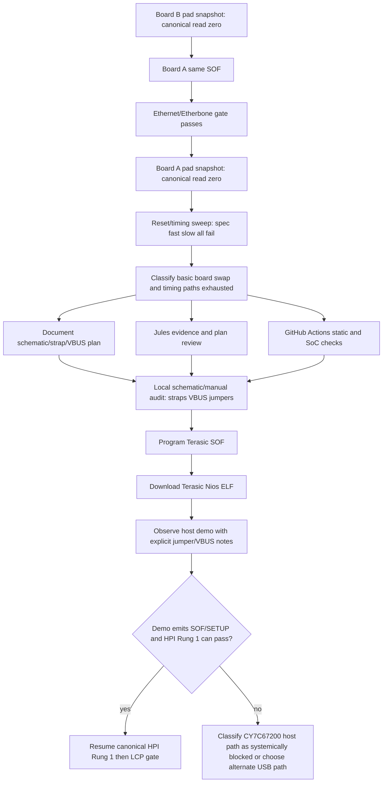
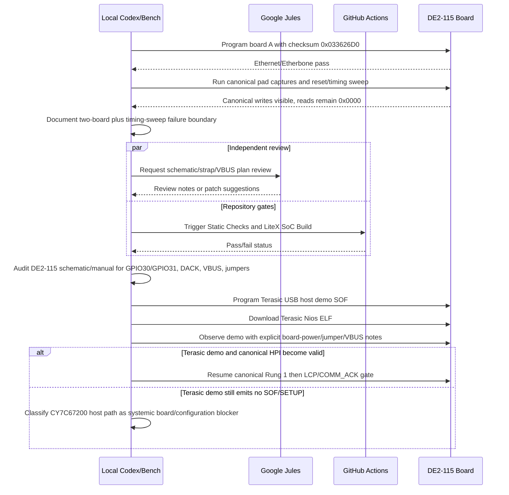

# DE2-115 Bring-Up Orchestration Plan

Date: 2026-05-17

## Current Findings

- Four DE2-115 boards are available for board swaps. Use swaps to separate
  board-specific damage from design-level behavior, but do not start with a
  swap when the same image and on-FPGA evidence can answer the question.
- The live board is now on the candidate pad-capture image checksum
  `0x033626D0`, saved as
  `artifacts/de2_115_vga_platform_hpi_pad_capture_033626D0_20260517.sof`.
- The previous current build SOF checksum `0x033B0F01` programmed but did not
  ping. The pad-capture candidate fixed that build boundary and passed the
  Ethernet gate.
- Fast canonical HPI still fails Rung 1 with all-zero readback.
- Fast index-15 / `legacy-data2-addr3` produces stable `0xf2f2`, but not the
  expected RAM words. Treat it as alias evidence, not a pass.
- HPI0 source/probe proves the FPGA bridge asserts an active canonical read
  cycle. The pad snapshot now additionally proves canonical writes drive the
  FPGA pad-facing data bus (`0x55aa`) and canonical reads still sample
  `0x0000`.
- Board A was swapped in for board B and reproduced the same canonical
  readback failure using the same `0x033626D0` SOF. The legacy/index-15 alias
  changed to `0xcfcf`, reinforcing that the alias is not valid HPI memory data.
- A board-A reset/timing sweep with longer reset dwell still failed canonical
  Rung 1 under `spec`, `fast`, and `slow` timing. Spec and slow pad snapshots
  also sampled `0x0000` on canonical reads.
- Prior Terasic host-demo isolation notes already show no SOF/SETUP traffic on
  two boards. The next useful question is therefore not "can LCP run?", but
  whether the DE2-115 CY7C67200 board configuration, VBUS/host power, or boot
  straps put the device into a usable HPI/host state.

## Delegation Model

| Work item | Best executor | Why |
| --- | --- | --- |
| Review current HPI evidence and schematic/strap/VBUS plan | Google Jules | Isolated design/doc review can run independently and does not need board access. |
| Python syntax checks and repository static checks | GitHub Actions | Pure software checks are repeatable and do not require DE2-115 hardware. |
| LiteX SoC generation in Docker | GitHub Actions or local Docker | No board access required; good CI gate before hardware compile. |
| Markdown/status/handoff updates | Local Codex | Needs the current bench state and must avoid stale hardware conclusions. |
| Quartus full compile, if RTL changes resume | Local Windows host | Requires installed Quartus; GitHub hosted runners do not have this setup. |
| Programming FPGA | Local Windows host | Requires USB-Blaster and physical board. |
| Ethernet regression | Local bench | Requires programmed board and network path to `192.168.178.50`. |
| HPI pad snapshot / ladder runs | Local bench | Requires programmed pad-capture SOF and Etherbone. |
| Terasic demo rerun with jumper/VBUS observations | Local bench | Requires physical board, USB path, and observation of board power/jumper state. |
| Terasic Nios application download | Local Windows host | Sequential after SOF programming. Use `scripts/run_terasic_usb_host_demo_host.ps1`; it converts ELF to SREC and downloads with `nios2-gdb-server.exe` without WSL. |
| Board swaps across the four DE2-115 boards | Local bench | Physical operation; board A and board B already match at the failure boundary. |

## Dependency Graph

## Sequencing Diagram

## Parallel Work

These can run in parallel:

- Jules review of the HPI evidence and schematic/strap/VBUS plan.
- GitHub Actions static checks and Docker SoC generation.
- Documentation updates, because they do not affect generated hardware.
- Locating external schematic/manual/demo collateral, provided the local bench
  state is not changed.

These must be sequential:

- Any new Quartus compile must wait for accepted source changes.
- FPGA programming must wait for a selected SOF/demo image.
- Ethernet regression must wait for programming when using the LiteX image.
- HPI pad snapshot must wait for Ethernet/Etherbone passing on the candidate image.
- Terasic demo rerun must wait for schematic/jumper/VBUS observation criteria.
- Terasic Nios application download must wait for the Terasic SOF to be loaded,
  but no longer depends on WSL.
- LCP/SIE/HID work must wait for canonical HPI Rung 1 passing.

## Execution State

| Task | Owner | Status |
| --- | --- | --- |
| Document current orchestration and four-board policy | Local | Done |
| Implement first-pass on-FPGA HPI pad snapshots | Local | Done |
| Python syntax check for pad script | Local | Done |
| HPI bridge simulation in Docker | Local | Done |
| Jules focused review | Jules | Session `14997796971249417694` created; still running at handoff |
| GitHub Actions delegation | Local/CI | Static Checks and LiteX SoC Build pass under manual dispatch |
| Quartus compile of candidate pad-capture image | Local | Done, checksum `0x033626D0` |
| Hardware program/regression/snapshot | Local bench | Done on board B and board A; canonical read still samples zero |
| Second-board confirmation | Local bench | Done; board A matches board B |
| Reset/timing sweep on board A | Local bench | Done; canonical still all zero |
| Schematic/strap/VBUS audit doc | Local | Started in `docs/HPI_RESET_STRAP_AUDIT_20260517.md` |
| Jules schematic/strap/VBUS review | Jules | Session `3912795874550261687` completed; RTL patch proposal rejected as stale/partial, review kept as advisory |
| GitHub Actions delegation for branch head | Local/CI | Static Checks and LiteX SoC Build pass after each pushed checkpoint |
| Terasic SOF programming | Local bench | Done on board A; SOF accepted over USB-Blaster |
| Terasic Nios application download | Local Windows host | Done without WSL via SREC plus `nios2-gdb-server.exe`; 80 KiB downloaded and verified OK |
| AgentUSB2KVM HID injection | Local bench | Done; direct HID reports sent through KVM2USB keyboard/touch/mouse interfaces |
| Terasic Beagle observation | Local bench | Done; repeated downstream connect/reset cycles seen, no SOF/SETUP packets even during HID injection |
| Terasic demo and schematic/VBUS/strap comparison | Local bench | Waiting on explicit physical USB host-power/jumper/VBUS observations |

## Recommendations

1. Keep the validated SOF programmed whenever pausing.
2. Use the new on-FPGA pad snapshot before swapping boards. It is the cheapest
   way to confirm what the FPGA pad-facing inputs see.
3. If the candidate pad-capture image fails Ethernet, stop USB work and fix the
   current build reproducibility problem first.
4. Pad snapshots now show the same canonical read failure on two boards, so
   treat the next phase as a design/protocol/reset/strap issue.
5. Reset/timing sweeps did not rescue canonical HPI; prioritize schematic,
   VBUS, jumper, and boot-strap evidence before any more RTL churn.
6. Do not resume LCP until canonical memory write/read returns expected data.
7. Treat the Terasic reference design and AgentUSB2KVM injection as runnable
   now, but still packet-silent in the observed setup. The next test variable
   is physical USB host power/jumpers/VBUS, not the software loader or HID
   injection path.
