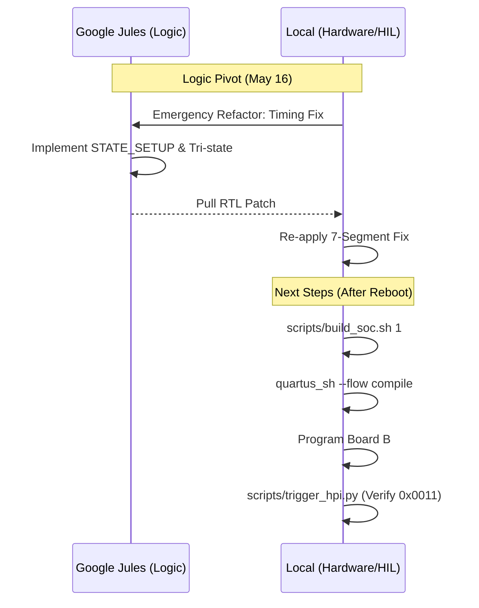

# DE2-115 Bring-up: Findings & Orchestration Plan

## 1. Findings & Current Status

### **Current Hardware Baseline**
- **SoC Core:** VexRiscv stable, UART diagnostics working.
- **Ethernet (P1):** 10/100 Mbps stable.
- **7-Segment Display:** Polarity fixed (active-low).
- **USB (CY7C67200):** Logical timing blocker. Readback returns `0x0000`.

### **Latest Evidence (Verified via Board Swap)**
- **Board B Failure:** Swapping to a second DE2-115 produced **identical failure modes** (0x0000 on readback).
- **Logical Failure Confirmed:** Since two boards fail identically, the "Physical Stuck Pin" hypothesis is **REJECTED**.
- **RTL Refactor:** Implemented `STATE_SETUP` (address setup time) and explicit data bus tri-stating.

---

## 2. Recommendations

1.  **Regenerate SoC:** Force a top-level regeneration to ensure the 7-segment fix and HPI timing logic are fully integrated.
2.  **Timing Validation:** Verify the new timing state machine on Board B.
3.  **LCP Handshake:** Once readback is restored, proceed to load the USB host firmware.

---

## 3. Orchestration Plan: Delegation & Execution

### **Task Allocation**
| Delegate | Responsibility | Tasks | Status |
| :--- | :--- | :--- | :--- |
| **Google Jules** | **RTL Refactoring** | Emergency timing refactor complete. | **DONE** |
| **Local Agent** | **HIL / Build** | Regenerate SoC, Full Build, Program. | **PENDING REBOOT** |

### **Execution Matrix**

| Task ID | Description | Delegate | Type | Dependencies |
| :--- | :--- | :--- | :--- | :--- |
| **T4.1** | Regenerate SoC (7seg + HPI fixes) | **Local** | Logic | None |
| **T4.2** | Full Quartus Compile | **Local** | Build | T4.1 |
| **T4.3** | Verify HPI Readback (0x0011) | **Local** | HIL | T4.2 |
| **T5.1** | Initialize USB Host Stack | **Local** | FW | T4.3 |

---

## 4. Sequencing Diagram (Mermaid)

