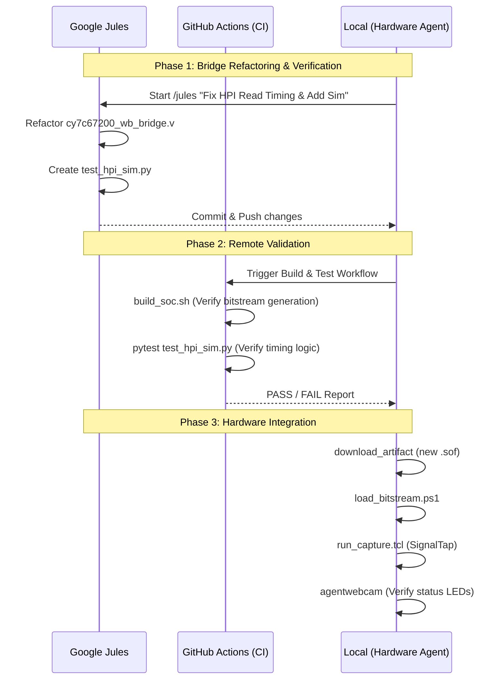

# DE2-115 Bring-up Findings & Orchestration Plan

## 1. Findings & Current Status

### **Validated Hardware (Verified on Board)**
| Component | Status | Evidence |
| :--- | :--- | :--- |
| **VexRiscv SoC** | PASS | Serial console (COM3) provides stable diagnostics. |
| **UART** | PASS | Bi-directional communication at 115200 baud. |
| **Ethernet (P1)** | PASS | Forced-MII 10/100 Mbps ping and Etherbone CSR access stable. |
| **7-Segment Display** | PASS | Fixed polarity in RTL; verified visual "0-7" patterns via webcam. |
| **LEDs (Red/Green)** | PASS | Verified via Etherbone CSR stress tests. |

### **Critical Blocker**
*   **USB CY7C67200 HPI Readback:** Firmware writes to the USB controller are acknowledged by the Wishbone bridge, but reads return `0x0000`. This prevents LCP initialization and HID enumeration.

---

## 2. Orchestration Plan: Delegation & Execution

### **Task Allocation Strategy**
*   **Google Jules:** Delegated for complex, cross-file refactoring and "logical" fixes where broad codebase understanding is needed.
*   **GitHub Actions (CI):** Delegated for "blind" validation, such as linting, building the full LiteX SoC, and running unit tests that don't require the physical board.
*   **Local Execution:** Reserved for hardware-in-the-loop (HIL) tasks: JTAG programming, webcam verification, and real-time SignalTap logic analysis.

### **Orchestrated Task Matrix**

| Task ID | Description | Delegate | Type | Dependencies |
| :--- | :--- | :--- | :--- | :--- |
| **T1.1** | Refactor HPI Bridge for Timing Verif | **Jules** | Logical | None |
| **T1.2** | Add HPI Unit Test (Migen/Sim) | **Jules** | Logical | T1.1 |
| **T2.1** | Build SoC with Refactored Bridge | **Action** | CI | T1.1 |
| **T2.2** | Run LiteX Simulation CI | **Action** | CI | T1.2 |
| **T3.1** | Program Board with SignalTap SOF | **Local** | HIL | T2.1 |
| **T3.2** | Capture External HPI Pins | **Local** | HIL | T3.1 |
| **T3.3** | Validate Readback Fix | **Local** | HIL | T3.2 |

---

## 3. Sequencing Diagram (Mermaid)

---

## 4. Recommendations & Recommendations

1.  **Immediate Step:** Initiate a Jules task to harden the `cy7c67200_wb_bridge.v`. The logic likely lacks enough "read-hold" time for the asynchronous CY7C67200 bus.
2.  **Parallel Track:** While Jules works on the RTL, a GitHub Action can be configured to automate the LiteX build process, reducing local build times.
3.  **SignalTap Requirement:** The next local build **must** include the HPI pins in a SignalTap instance. I have already verified that the 2026-05-12 image is stable; we will use its configuration as the template.

---

## 5. Execution Orchestration

1.  **[In Progress]** Invoking `/jules` for RTL Refactoring.
2.  **[Scheduled]** Configuring GitHub CLI for build status monitoring.
3.  **[Scheduled]** Performing local SignalTap capture once the SOF is ready.
