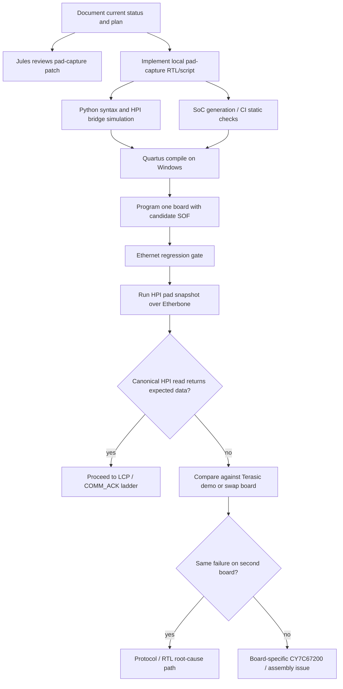
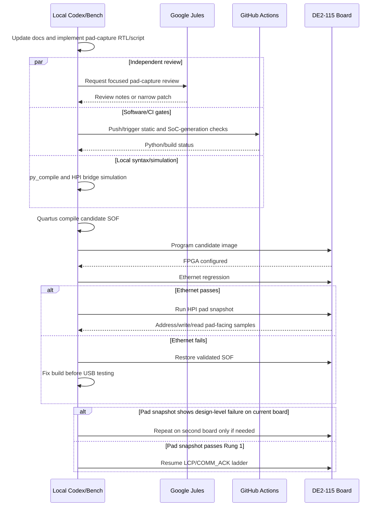

# DE2-115 Bring-Up Orchestration Plan

Date: 2026-05-17

## Current Findings

- Four DE2-115 boards are available for board swaps. Use swaps to separate
  board-specific damage from design-level behavior, but do not start with a
  swap when the same image and on-FPGA evidence can answer the question.
- The live board is now on the candidate pad-capture image checksum
  `0x033626D0`, saved as
  `artifacts/de2_115_vga_platform_hpi_pad_capture_033626D0_20260517.sof`.
- The previous current build SOF checksum `0x033B0F01` programmed but did not
  ping. The pad-capture candidate fixed that build boundary and passed the
  Ethernet gate.
- Fast canonical HPI still fails Rung 1 with all-zero readback.
- Fast index-15 / `legacy-data2-addr3` produces stable `0xf2f2`, but not the
  expected RAM words. Treat it as alias evidence, not a pass.
- HPI0 source/probe proves the FPGA bridge asserts an active canonical read
  cycle. The pad snapshot now additionally proves canonical writes drive the
  FPGA pad-facing data bus (`0x55aa`) and canonical reads still sample
  `0x0000`.

## Delegation Model

| Work item | Best executor | Why |
| --- | --- | --- |
| Review narrow RTL/script pad-capture patch | Google Jules | Isolated code review can run independently and does not need board access. |
| Python syntax checks and repository static checks | GitHub Actions | Pure software checks are repeatable and do not require DE2-115 hardware. |
| LiteX SoC generation in Docker | GitHub Actions or local Docker | No board access required; good CI gate before hardware compile. |
| Quartus full compile | Local Windows host | Requires installed Quartus; GitHub hosted runners do not have this setup. |
| Programming FPGA | Local Windows host | Requires USB-Blaster and physical board. |
| Ethernet regression | Local bench | Requires programmed board and network path to `192.168.178.50`. |
| HPI pad snapshot run | Local bench | Requires programmed pad-capture SOF and Etherbone. |
| Board swaps across the four DE2-115 boards | Local bench | Physical operation; only after image-level evidence justifies it. |

## Dependency Graph

## Sequencing Diagram

## Parallel Work

These can run in parallel:

- Jules review of `cy7c67200_wb_bridge.v` and `scripts/hpi_pad_capture_debug.py`.
- GitHub Actions static checks and Docker SoC generation.
- Local Python syntax checks and HPI bridge simulation.
- Documentation updates, because they do not affect generated hardware.

These must be sequential:

- Quartus compile must wait for accepted RTL/source changes.
- FPGA programming must wait for Quartus compile.
- Ethernet regression must wait for programming.
- HPI pad snapshot must wait for Ethernet/Etherbone passing on the candidate
  image.
- LCP/SIE/HID work must wait for canonical HPI Rung 1 passing.
- Board swaps should wait until the same candidate image has a clear pass/fail
  on one board.

## Execution State

| Task | Owner | Status |
| --- | --- | --- |
| Document current orchestration and four-board policy | Local | Done |
| Implement first-pass on-FPGA HPI pad snapshots | Local | Done |
| Python syntax check for pad script | Local | Done |
| HPI bridge simulation in Docker | Local | Done |
| Jules focused review | Jules | Session `14997796971249417694` created; still running at handoff |
| GitHub Actions delegation | Local/CI | Static Checks `25988340470` passed; LiteX SoC Build `25988340381` passed |
| Quartus compile of candidate pad-capture image | Local | Done, checksum `0x033626D0` |
| Hardware program/regression/snapshot | Local bench | Done on first board; canonical read still samples zero |
| Second-board confirmation or Terasic demo comparison | Local bench | Next sequential task |

## Recommendations

1. Keep the validated SOF programmed whenever pausing.
2. Use the new on-FPGA pad snapshot before swapping boards. It is the cheapest
   way to confirm what the FPGA pad-facing inputs see.
3. If the candidate pad-capture image fails Ethernet, stop USB work and fix the
   current build reproducibility problem first.
4. If pad snapshots show the same canonical read failure on two boards, treat it
   as a design/protocol issue. If one board differs, isolate the board-specific
   CY7C67200 path.
5. Do not resume LCP until canonical memory write/read returns expected data.
