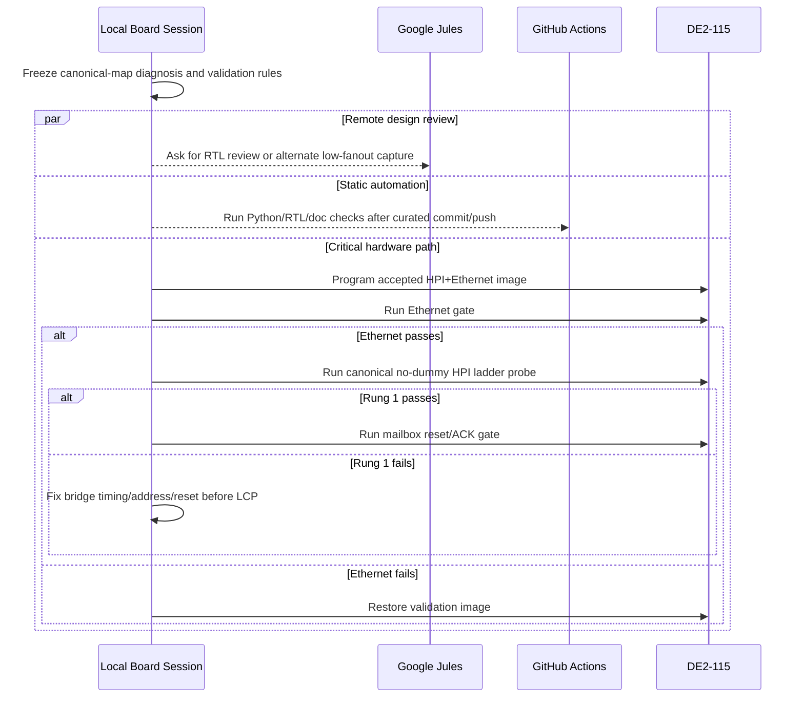

# CY7C67200 HPI Research and Recovery Plan

Date: 2026-05-11

## Current Status

The bring-up ladder remains on Rung 1: HPI protocol stabilization. The best
known HPI plus Ethernet candidate is checksum `0x033E503E`, which passed the
Ethernet gate and showed live HPI data visibility. The board is currently
restored to the Ethernet-safe validation image `0x033C9E9A`, which should not be
treated as the best HPI diagnostic image.

Update: a rebuilt pulse-only candidate programmed as checksum `0x033B0DAC` on
2026-05-11, but failed the Ethernet gate at ping timeout. It is archived as a
failed candidate and must not be used for HPI conclusions.

Update 2: a constraint-only rebuild that restored the root QSF's RGMII
`FAST_OUTPUT_REGISTER` assignments also programmed as checksum `0x033B0DAC` and
failed the Ethernet gate. Quartus reported those fast I/O assignments as
ignored, so this path is rejected. The root-level `de2_115_vga_platform.sof`
was identified as checksum `0x032C9C4C`, not the accepted `0x033E503E`.

Update 3: seed 1 was run through `scripts/run_hpi_seed_candidate.ps1`. It
compiled and programmed as checksum `0x033B0DAC`, failed the Ethernet ping gate,
and was archived under `artifacts/seed_candidates`. The script restored
validation checksum `0x033C9E9A`, and recovery Ethernet passed.

Rung 2 LCP reset/ACK is still blocked until Rung 1 proves real CY7C67200
address/data access through the canonical HPI ports.

## Primary Reference Findings

Source links used:

- Cypress CY7C67200 datasheet mirror:
  `https://www.digikey.at/htmldatasheets/production/290766/0/0/1/cy7c67200.html`
- Linux `c67x00` HPI driver:
  `https://codebrowser.dev/linux/linux/drivers/usb/c67x00/c67x00-ll-hpi.c.html`
- Local Terasic demo:
  `DE2_115_demonstrations/DE2_115_NIOS_HOST_MOUSE_VGA/software/DE2_115_NIOS_HOST_MOUSE_VGA/DE2_115_NIOS_HOST_MOUSE_VGA.c`

The Cypress CY7C67200 datasheet, the upstream Linux `c67x00` HPI driver, and
the Terasic Nios host mouse demo agree on the HPI port order:

| HPI A1:A0 | Port | LiteX byte offset |
| --- | --- | --- |
| `00` | HPI Data | `0x000` |
| `01` | HPI Mailbox | `0x004` |
| `10` | HPI Address | `0x008` |
| `11` | HPI Status | `0x00c` |

The same references also agree on the transaction model:

- Set `HPI_ADDR`, then read or write `HPI_DATA`.
- Sequential data-port accesses auto-increment the internal HPI pointer.
- The HPI cycle time is at least `6T`, where `T = 1/48 MHz`; this is about
  125 ns. The 50 MHz FPGA system clock therefore needs at least seven bridge
  cycles to be comfortably inside the datasheet limit.
- `GPIO31:30 = 00` selects HPI boot mode. If those straps are wrong, HPI cannot
  be the active coprocessor interface after reset.

Local confirmation:

- `firmware/src/main.c` already uses canonical offsets.
- `DE2_115_demonstrations/DE2_115_NIOS_HOST_MOUSE_VGA/software/.../DE2_115_NIOS_HOST_MOUSE_VGA.c`
  uses `HPI_DATA=0`, `HPI_MAILBOX=1`, `HPI_ADDR=2`, `HPI_STATUS=3`.
- `DE2_115_demonstrations/.../CY7C67200_IF.v` is the same registered
  Terasic-style wrapper pattern used locally.

## Diagnosis

The previous aliasing conclusion is plausible but not yet proven. Several local
diagnostics used one or both of these invalid assumptions:

- A swapped target map where `DATA=0x8` and `ADDR=0xc`.
- A dummy-read pattern where the first read is discarded and the second read is
  treated as the same address.

Because HPI data reads auto-increment the CY address pointer, the dummy-read
pattern can read the next word, not the requested word. That can make bus echo,
address-pointer failure, or a shifted block read look like high-address
aliasing.

Working hypothesis now:

1. The canonical map is the only acceptable target for the ladder.
2. The old swapped map is useful only as a negative control.
3. The next hardware test must use canonical ports, no dummy reads, and block
   read/write patterns that make auto-increment explicit.
4. LCP must not run until canonical memory block and separated-address tests
   pass.

## Validation Harness

Added:

- `scripts/cy7c67200_hpi.py`: shared HPI register-map, timing, reset, memory,
  mailbox, and bridge-debug helpers.
- `scripts/cy_hpi_ladder_probe.py`: Etherbone ladder probe that:
  - runs canonical and legacy map controls,
  - tests block auto-increment without dummy reads,
  - tests separated writes to non-adjacent RAM addresses,
  - reads key CY registers as observations,
  - gates Rung 2 mailbox reset behind canonical Rung 1 success.

Recommended command after programming the accepted HPI plus Ethernet image:

```powershell
python scripts\cy_hpi_ladder_probe.py --start-server --port 1235 --timings spec,fast --attempt-mailbox --json-out artifacts\cy_hpi_ladder_probe_20260511.json
```

Expected decision tokens:

- `CY_HPI_RUNG1_PASS timing=<profile> map=canonical`: proceed to Rung 2.
- `CY_HPI_RUNG1_FAIL map=canonical`: do not retry LCP; classify bridge/pin/reset.
- `CY_HPI_RUNG2_RESULT ... result=PASS`: mailbox reset ACK was observed.
- `CY_HPI_RUNG2_RESULT ... result=TIMEOUT`: mailbox/LCP still blocked after
  canonical memory access is proven.

## Task Relationships



## Orchestration Plan

Sequential local tasks:

1. Recreate or reprogram checksum `0x033E503E`, then run the Ethernet gate.
2. If `0x033E503E` cannot be recovered, run a controlled seed-candidate loop.
   `scripts/run_hpi_seed_candidate.ps1` sets one Quartus seed, compiles,
   programs, runs the Ethernet gate, archives the SOF, and only then can run the
   canonical HPI ladder probe.
3. Run `cy_hpi_ladder_probe.py` with `spec,fast` timing profiles only on an
   Ethernet-passing HPI image.
4. If canonical Rung 1 passes, let the same script attempt mailbox reset.
5. Record checksum, timing profile, map result, and mailbox result in
   `FINDINGS.md` and `HANDOFF.md`.

Parallel-safe delegated tasks:

- Jules: review `rtl/cy7c67200_wb_bridge.v`, `rtl/CY7C67200_IF.v`, and the new
  harness for low-fanout capture or sequencing defects. This can run while local
  hardware validation runs, but cannot replace board evidence.
- GitHub Actions: run static syntax checks after a curated commit/push. Hosted
  Actions cannot validate Quartus, USB-Blaster programming, live Ethernet, or
  CY7C67200 behavior.

Local-only tasks:

- Quartus compile/programming.
- Ethernet acceptance gate.
- Etherbone HPI ladder probe.
- Any decision to advance from Rung 1 to Rung 2.

## Next Fix Direction If Rung 1 Still Fails

If the canonical no-dummy probe fails on an Ethernet-passing HPI image, fix in
this order:

1. Verify HPI boot straps `GPIO31:30 = 00` and reset release timing.
2. Use existing HPI0 source/probe or an external analyzer to prove physical
   `OTG_ADDR[1:0]`, `nCS`, `nRD`, `nWR`, and `DATA[15:0]` during one canonical
   address write and one canonical data access.
3. Only after pad evidence shows the FPGA is wrong, change RTL address/control
   sequencing.
4. Only after pad evidence shows the FPGA is right, investigate CY boot mode,
   reset, or board-level HPI wiring.
