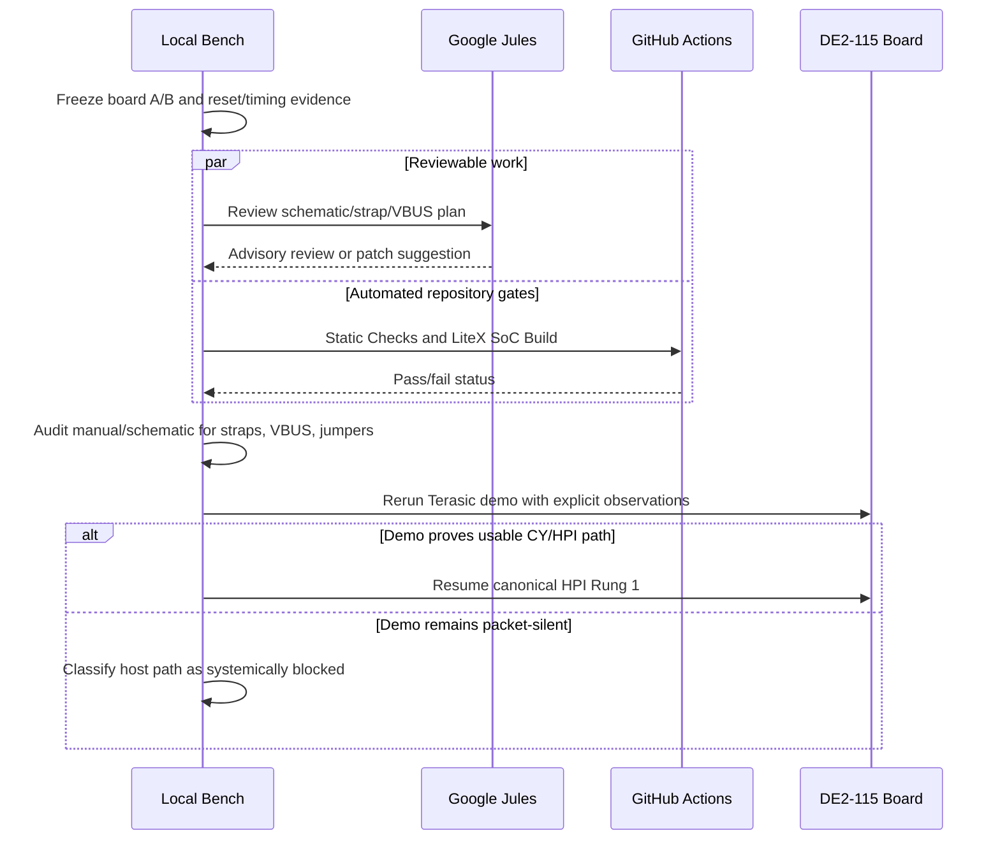

# CY7C67200 HPI Reset/Strap Audit

Date: 2026-05-17

## Current Evidence

- Board B and board A both accept the same pad-capture SOF checksum
  `0x033626D0`.
- Board A passes the Ethernet/Etherbone gate on this image.
- Canonical HPI writes are visible at the FPGA pad-facing bus:
  `addr=0`, `CS_N=0`, `WR_N=0`, `hpi_data=0x55aa`.
- Canonical HPI reads are actively issued:
  `addr=0`, `CS_N=0`, `RD_N=0`, `WR_N=1`.
- Canonical HPI read data remains `0x0000` on board B and board A.
- A reset dwell of `0.5 s` low and `2.0 s` high did not change canonical
  readback. `spec`, `fast`, and `slow` timing profiles all failed Rung 1.
- Legacy/index-15 read aliases vary by board and timing (`0xbfbf`, `0xcfcf`,
  `0x1313`, `0x0101`, and related values). Treat these as alias/floating
  evidence, not valid CY memory data.
- Prior Terasic host-demo isolation runs also failed on two boards: the Beagle
  saw connect/disconnect/reset indications, but no SOF or SETUP packets.

## Reference Sources

- Terasic DE2-115 user manual, USB OTG/HPI section:
  `https://www.terasic.com.tw/wiki/images/f/f2/DE2_115_manual.pdf`
- Cypress CY7C67200 datasheet, HPI boot mode and GPIO31/GPIO30 boot strap
  behavior:
  `https://www.digikey.at/htmldatasheets/production/290766/0/0/1/cy7c67200.html`

## Local Pin/Ownership Audit

- The current LiteX platform assigns only documented DE2-115 OTG HPI pins:
  `OTG_DATA[15:0]`, `OTG_ADDR[1:0]`, `OTG_CS_N`, `OTG_RD_N`, `OTG_WR_N`,
  `OTG_RST_N`, `OTG_INT`, secondary `int1`, and `OTG_DREQ[0]`.
- The generated QSF assigns no DACK, GPIO30, GPIO31, VBUS-enable, or wake pins
  from this design.
- `de2_115_vga_target.py` explicitly leaves CY7C67200 boot-selection sideband
  pins to board straps and sets `force_hpi_boot=0`.
- `CY7C67200_IF.v` only drives `HPI_DATA` when `HPI_WR_N` is low. During reads
  it tri-states the FPGA side of the bus.

## Terasic Host Demo Audit

- Local reference package:
  `DE2_115_demonstrations/DE2_115_NIOS_HOST_MOUSE_VGA`.
- The Terasic batch flow is two-stage: program
  `DE2_115_NIOS_HOST_MOUSE_VGA.sof`, then run `nios2-download` on
  `DE2_115_NIOS_HOST_MOUSE_VGA.elf` and attach `nios2-terminal`.
- The Terasic QSF assigns the same primary CY7C67200 HPI pins used by the
  current LiteX design. It also assigns `GPIO[30]` and `GPIO[31]` to pins
  `AE20` and `AG23`, but those GPIOs are not exposed in the inspected
  top-level USB host-demo port list.
- The Terasic reset component initializes reset low and expects Nios software
  to release the CY7C67200 later. Our reset dwell testing already covers a
  comparable hold-low/release-high boundary.
- The Terasic software's `UsbSoftReset()` and SIE setup are post-HPI operations.
  They are useful reference behavior, but they should not be ported into the
  LiteX ladder until canonical HPI Rung 1 readback works.

## 2026-05-17 Demo Execution Attempt

- Board A successfully accepted the Terasic SOF over USB-Blaster.
- The Nios ELF/application step was not completed. Per user direction the
  attempt was made in the Docker container instead of direct WSL.
- The existing `litex_builder` container sees the mounted Windows Quartus/Nios
  tree and the Terasic ELF/JDI, but it has no visible `/dev/bus/usb` devices.
- The mounted Nios helper binaries are from the Windows Quartus installation.
  The Linux container can run the shell wrapper far enough to print help, but
  the actual download path fails because the wrapper detects the Docker Desktop
  WSL2 kernel and then expects WSL path helpers and Windows `.exe` tools.
- Board A was restored to the candidate pad-capture image
  `artifacts/de2_115_vga_platform_hpi_pad_capture_033626D0_20260517.sof`
  after this attempt.

## Environment Requirement To Finish Demo

To complete the Terasic host demo without direct WSL, use one of these paths:

1. Build or provide a container image with native Linux Intel Quartus/Nios tools
   and pass the USB-Blaster device through to the container.
2. Use the host Windows Nios tools directly for `nios2-download` and
   `nios2-terminal`.

The current Docker setup is sufficient for LiteX/SoC builds, but not sufficient
for the Terasic Nios ELF download.

## Interpretation

The FPGA side now has enough evidence to show that canonical write cycles and
canonical read strobes reach the pad-facing interface. Since the same all-zero
canonical readback appears on two boards and survives reset/timing sweeps, the
most likely remaining causes are outside the basic Wishbone transaction path:

- CY7C67200 boot strap or sideband state is not selecting/holding the expected
  HPI coprocessor mode.
- Board-level USB OTG power/VBUS/host-port condition prevents the CY from
  reaching the expected state.
- There is a DE2-115 schematic/jumper requirement not represented in the
  current pin list.
- Less likely: a subtle HPI protocol requirement still missing despite correct
  visible strobes.

## Next Local Boundary

Do not run LCP, SIE, or HID work.

The next useful local boundary is schematic and demo comparison:

1. Identify CY7C67200 GPIO30/GPIO31 boot strap nets, DACK/sideband nets,
   VBUS/host power enable, and any jumpers or solder options in the DE2-115
   schematic/manual.
2. Re-run the Terasic USB host demo only after the Nios ELF download path is
   available, with explicit board-power/jumper/VBUS observations recorded.
3. If the Terasic demo still emits no SOF/SETUP under confirmed power/strap
   conditions, classify the DE2-115 CY7C67200 host path as systemically blocked
   for this project and choose whether to continue with HPI device-mode-only
   research or defer USB.

## Delegation and Sequencing

