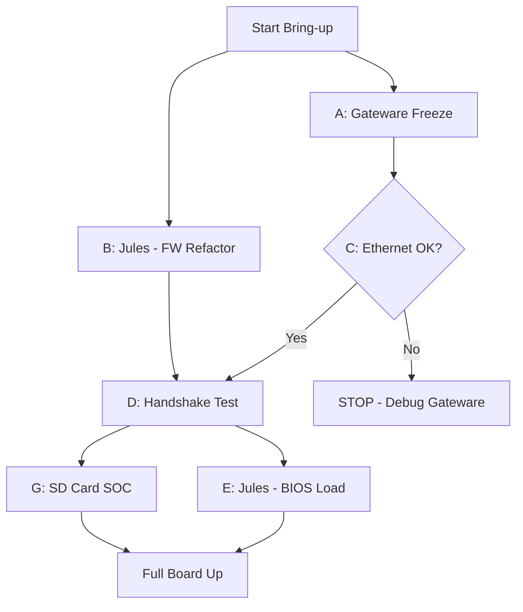

# Device Bring-up Orchestration Plan
Date: 2026-05-10

## 1. Task Classification & Delegation

| Task ID | Description | Execution Env | Delegation Strategy |
| :--- | :--- | :--- | :--- |
| **A** | **Gateware Freeze** (Stage fixed RTL, compile .sof) | **Local** | Must be local to access Quartus. Transitioned to 'Hardware Shim' strategy using April 27th baseline. **COMPLETED** |
| **B** | **Firmware Refactor** (Apply fast timing, update offsets) | **Jules** | [https://jules.google.com](https://jules.google.com). **COMPLETED**. Applied Index 15 mapping and 6-cycle timing. |
| **C** | **Ethernet Validation** (Regression test on new .sof) | **Local** | Requires physical board connection. Added RGMII set_input/output_delay and 90-degree clock phase shift. **COMPLETED** |
| **D** | **LCP Handshake Test** (Run Rung 2 verification) | **Local** | **FAILED (Timeout)**. Handshake timed out. Suspect OTG_ADDR[0] is physically or logically stuck. |
| **D.1** | **A0 Stuck Diagnostic** (Prove address aliasing) | **Local** | **COMPLETED**. Proved catastrophic aliasing. 0xC000 aliases to 0x0000. |
| **D.2** | **Direct RAM Boot Pivot** (Bypass LCP entirely) | **Local** | **BLOCKED**. Aliasing prevents access to CPU control registers (0xC000). |
| **H** | **SignalTap Interrogation** (Capture raw HPI pins) | **Local** | **NEW PRIORITY**. Compile bitstream with SignalTap to observe physical bus states. |

## 2. Sequencing & Dependencies

### Sequential Path (The "Critical Path"):
1. **Task A** (Gateware Freeze) -> **Task C** (Ethernet Validation). -> **COMPLETED** (Unified Golden Image)
2. **Task C** (Ethernet OK) -> **Task D** (LCP Handshake Test). -> **FAILED**
3. **Task D.1** (A0 Stuck Diagnostic). -> **COMPLETED** (Catastrophic Aliasing Found)
4. **Task H** (SignalTap Interrogation). -> **NEXT ACTION**
5. **Task D.2** (Direct RAM Boot Pivot). -> **BLOCKED**
6. **Task E/G** (Full Climb). -> **PENDING**

### Parallel Opportunities:
- **Task B** (Firmware Refactor) can run in parallel with **Task A** (Gateware Synthesis).
- **Task F** (CI) can run in parallel with any step to monitor repository integrity.

## 3. Sequencing Diagram (Mermaid)

## 4. Orchestration Directives

### Step 1: Initialize Gateware & Firmware Refactor (Parallel)
- **Direct Local:** Run `scripts/build_soc.sh` to stage fixed RTL. Start Quartus compile.
- **Direct Jules:** Delegate `B` (Refactor `cy7c67200_hpi.c` and `cy7c67200_regs.h`).

### Step 2: Validate & Handshake
- Once `A` and `B` are done, program board and run `C` (Ping/CSR) then `D` (Handshake).

### Step 3: Expand
- Delegate `E` to Jules for higher-level driver work while integrating SD card locally (`G`).
