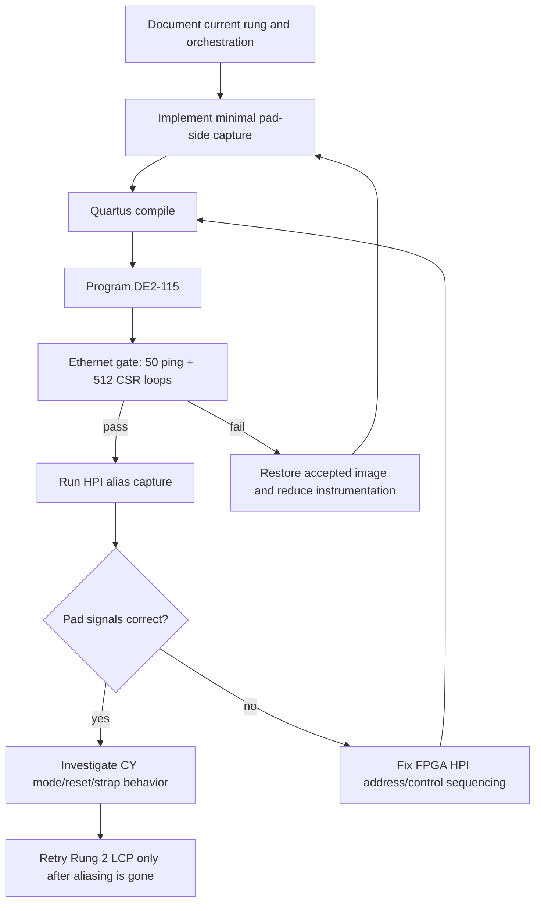
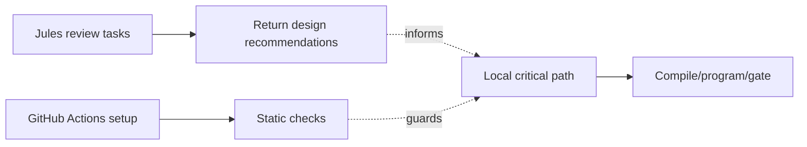

# USB HPI Aliasing Orchestration

Date: 2026-05-10

## Finding

Checksum `0x033E503E` is the current best ladder image. It preserves Ethernet
and proves the HPI data path is live, but the CY7C67200 address space still
aliases. Rung 1 is therefore not complete and Rung 2 LCP must not be retried
until the alias source is identified.

## Recommendation

Make the next implementation step a minimal FPGA-side capture of the HPI pad
transaction. The capture should answer one question:

> During a write/read that software believes targets `0xC000`, what address,
> data, direction, and strobes are present at the bridge/CY interface?

Avoid broad instrumentation until the minimal capture image passes Ethernet.
The previous broader write-capture timing patch produced checksum `0x033B4847`
and failed Ethernet.

## Local-Only Work

- Quartus compile, USB-Blaster programming, checksum capture.
- Ethernet acceptance gate.
- HPI alias test and any board-connected source/probe capture.
- Restoring the validated image if a candidate fails Ethernet.

## Jules-Suitable Work

- Review `cy7c67200_wb_bridge.v` and `CY7C67200_IF.v` for HPI address/control
  sequencing errors.
- Propose alternate low-fanout capture encodings if the local capture candidate
  breaks Ethernet.
- Review CY7C67200 HPI register ordering assumptions from existing scripts and
  docs.

Jules cannot validate hardware behavior. Jules output must be treated as design
input and gated locally.

## GitHub Actions-Suitable Work

- Static checks for Python scripts.
- Markdown link/lint checks.
- Verilog text-level checks if a linter is available.
- Quartus builds only on a runner with Quartus installed and licensed.

GitHub Actions cannot program the board or run Etherbone/HPI acceptance tests.

## Critical Path



## Parallel Work



## Completion Criteria

The current orchestration cycle is complete when one of these is true:

- A candidate image passes Ethernet and captures enough HPI pad evidence to
  classify aliasing as FPGA-side or CY-side.
- A candidate image fails Ethernet and the board is restored to the last
  accepted image with the failed checksum documented.

Only the first outcome advances the bring-up ladder.

## 2026-05-10 Execution Result

The first local capture implementation used three 64-bit Wishbone-readable
snapshots for address write, data write, and data read sample cycles. It
compiled and programmed as checksum `0x032653A2`, but failed the Ethernet gate.
The board was restored to checksum `0x033C9E9A`, and Ethernet passed again.

This classifies the attempt as a completed failed orchestration cycle. The
failed image is preserved under `artifacts/failed_candidates/`, but its HPI
results must not be used.

The next capture attempt should avoid adding new Wishbone-visible state and
should instead reuse the existing HPI0 `altsource_probe`/`dbg_probe` path or
an external analyzer.

## 2026-05-11 Next Cycle

The next candidate will reuse the existing HPI0 source/probe and only move the
write-cycle capture point inside the active fast HPI access window. This is the
lowest-impact RTL change available in the current design because it does not
add new CSRs, does not widen the probe, and does not add a separate capture
memory.

Expected evidence flow:

1. Patch HPI0 write capture timing.
2. Compile/program the candidate.
3. Run the Ethernet gate.
4. If the gate passes, arm HPI0 in address-write and data-write capture modes.
5. Trigger the software transaction that writes address `0xC000` and data
   `0x5555`.
6. Decode the 192-bit probe and classify the alias:
   - FPGA-side if the captured HPI register address, data, or strobes are wrong.
   - CY-side or board-side if the captured pad-side transaction is correct but
     `test_c000_alias.py` still mirrors through `0x0000`.

Parallel work:

- Jules review can run at the same time as local compile/program work, but its
  output is advisory until board-gated locally.
- GitHub Actions static checks can run after push, but hosted runners are not
  expected to build Quartus bitstreams unless a Quartus-capable self-hosted
  runner is configured.

## 2026-05-11 Result

The HPI0 source/probe timing candidate compiled and programmed as checksum
`0x033B4847`, then failed the Ethernet gate at the ping stage. The board was
restored to checksum `0x033C9E9A`, which passed 50/50 ping and 512 CSR loops.
The failed timing patch was removed from the default bridge sources after the
SOF was archived.

This completes the cycle as a failed candidate. The failed SOF is archived at:

```text
artifacts\failed_candidates\de2_115_vga_platform_hpi0_source_probe_timing_033B4847_failed_eth_20260511.sof
```

Do not use HPI data from `0x033B4847`. The next useful paths are:

- wait for Jules review session `12158000886042813489`,
- recreate and archive the accepted pulse-only image `0x033E503E` before any
  more instrumentation,
- run a seed/placement sweep only if each candidate is Ethernet-gated, or
- use an external analyzer/autonomous capture path that does not require
  Ethernet to remain functional for the trigger.

Jules session `12158000886042813489` completed after this local cycle. Its
proposal was not applied, but it gives a concrete next RTL candidate: qualify
RD/WR with an explicit `STATE_WAIT` strobe, expose stable latched address/data
in HPI0, and avoid early TURNAROUND exit on `!wb_access`. Those changes should
be tested only as a new candidate with the normal Ethernet gate.

## 2026-05-11 Jules Candidate Result

The Jules strobe/latched-probe candidate was tested as checksum `0x033928D3`.
It compiled and programmed, but failed the Ethernet gate at ping timeout. The
SOF was archived at:

```text
artifacts\failed_candidates\de2_115_vga_platform_jules_hpi_strobe_latched_probe_033928D3_failed_eth_20260511.sof
```

The board was restored to checksum `0x033C9E9A`, and recovery passed 50/50 ping
plus 512 CSR loops. The candidate changes were removed from the default source
after archiving.

This leaves the same ladder blocker in place: address aliasing cannot be
classified without an Ethernet-safe HPI+capture image or an external/autonomous
capture path.

## 2026-05-11 Research Rebaseline

The aliasing work is now superseded by the canonical HPI probe plan in
`docs/CY7C67200_HPI_RESEARCH_AND_RECOVERY_PLAN.md`. Primary references agree
that the target map is data `0x000`, mailbox `0x004`, address `0x008`, status
`0x00c`; the swapped-map scripts are negative controls only.

Do not run another `0xC000` write-based alias test as the next step. First run
`scripts/cy_hpi_ladder_probe.py`, which uses canonical ports and no dummy data
reads. Only if that probe fails should the next evidence path return to
pad-side address/control capture.

## 2026-05-11 Rebuild Attempt

The pulse-only bridge was rebuilt and programmed as checksum `0x033B0DAC`, but
failed the Ethernet gate at the ping stage. The SOF is archived at:

```text
artifacts\failed_candidates\de2_115_vga_platform_rebuilt_pulse_only_033B0DAC_failed_eth_20260511.sof
```

The board was restored to checksum `0x033C9E9A`, and recovery Ethernet passed.
The canonical HPI probe remains the next diagnostic, but only after an
Ethernet-passing HPI image is available.
